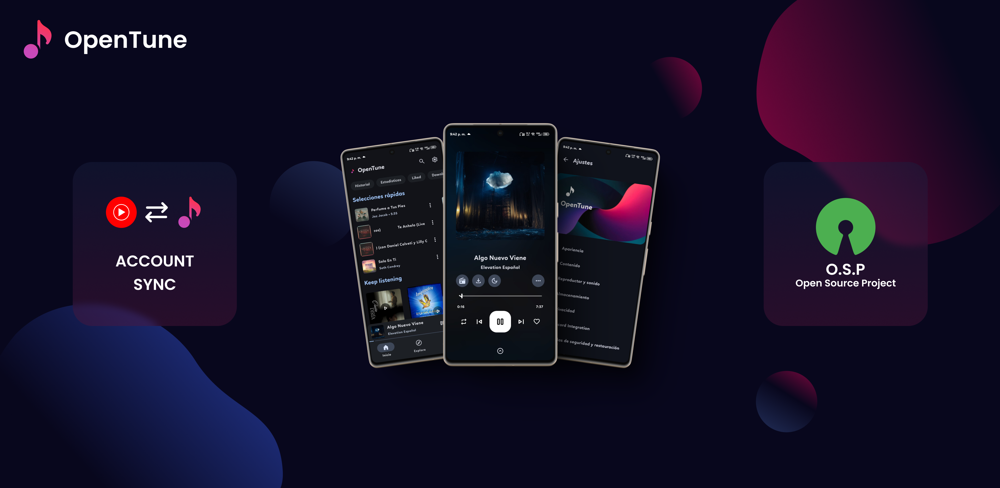

<div align="center">

# 🎵 Musiq

### A modern, ad-free music player for Android

[](LICENSE)
[](https://www.android.com)
[](https://developer.android.com/about/versions)
[](https://github.com/dhrubonai/musiq/releases/latest)
[](https://github.com/dhrubonai/musiq/releases)



</div>

---

## 📖 About

**Musiq** is a free, open-source music player for Android that lets you stream and download music without ads, subscriptions, or mandatory sign-ups. Built on top of the [OpenTune](https://github.com/Arturo254/OpenTune) project (with permission under GPL-3.0), Musiq adds a premium black & white high-contrast theme, a cleaner interface, and a focus on simplicity.

Just install the app and start listening — no account required.

---

## ✨ Features

### 🎧 Music Playback
- **Ad-free streaming** — no interruptions
- **Background playback** — keep listening when the app is closed
- **Offline downloads** — save songs for when you have no internet
- **Synced lyrics** — sing along with real-time lyrics
- **Queue management** — full control over your playback queue
- **Sleep timer** — fall asleep to music

### 🎨 Premium Design
- **Black & white high-contrast theme** — easy on the eyes, premium feel
- **Vinyl record logo** — custom-designed app icon
- **Clean, modern interface** — no clutter, no distractions
- **Material Design 3** — follows the latest Android design guidelines

### 🔒 Privacy First
- **No data collection** — your listening habits stay on your phone
- **No tracking** — no analytics, no ads, no telemetry
- **No mandatory account** — works without any sign-up
- **Optional Google sign-in** — sync your YouTube Music playlists (if you want)

### 📱 Built for Everyone
- Works on Android 7.0+ (API 24)
- Lightweight — won't drain your battery
- Supports low-end devices
- Available in multiple languages

---

## 📲 Installation

### Download the APK
1. Go to the [Latest Release](https://github.com/dhrubonai/musiq/releases/latest)
2. Download `Musiq.apk`
3. Transfer it to your Android phone
4. Allow "Install from unknown sources" in your phone settings
5. Tap the APK file to install

### Build from Source
```bash
# Clone the repository
git clone https://github.com/dhrubonai/musiq.git
cd musiq

# Build the APK
./gradlew assembleArm64Release

# The APK will be at:
# app/build/outputs/apk/arm64/release/Musiq.apk
```

**Requirements:**
- Android Studio (latest version)
- JDK 21
- Android SDK (API 36)

---

## 🔄 Auto-Update

Musiq checks for updates automatically. When a new version is released on GitHub:
1. You'll see an "Update available" notification in the app
2. Tap it to download the new APK
3. Install the update — no need to visit GitHub manually

To manually check for updates, go to **Settings → About**.

---

## 👨‍💻 Developer

**Mohiuddin Abdul Kadir Dhrubo**

<div align="center">

| Platform | Link |
|----------|------|
| 📧 **Gmail** | [dhrubomohiuddinabdulkadir@gmail.com](mailto:dhrubomohiuddinabdulkadir@gmail.com) |
| 📘 **Facebook** | [dhrubo.morse](https://www.facebook.com/share/1LLhAmRUp2/) |
| 📸 **Instagram** | [@dhrubo_morse](https://www.instagram.com/dhrubo_morse?igsh=aHNsazZyOTY4dWN2) |
| ✈️ **Telegram Channel** | [Join Musiq Updates](https://t.me/+4f6o21r4DI1iNmNl) |
| 💖 **Donate** | [Support Musiq Development](https://donation.cinevix.fun) |

</div>

---

## 🙏 Acknowledgements

Musiq is built on top of these amazing open-source projects:

- **[OpenTune](https://github.com/Arturo254/OpenTune)** by Arturo254 — the base project (GPL-3.0)
- **[InnerTune](https://github.com/z-huang/InnerTune)** by z-huang — the original YouTube Music client
- **[NewPipe Extractor](https://github.com/TeamNewPipe/NewPipeExtractor)** — for content extraction
- **[ExoPlayer](https://github.com/google/ExoPlayer)** — media playback
- **[Jetpack Compose](https://developer.android.com/jetpack/compose)** — modern Android UI toolkit
- **[Material Design 3](https://m3.material.io/)** — design system

---

## 📜 License

```
Musiq - A modern, ad-free music player for Android
Copyright (C) 2026 Mohiuddin Abdul Kadir Dhrubo

This program is free software: you can redistribute it and/or modify
it under the terms of the GNU General Public License as published by
the Free Software Foundation, either version 3 of the License, or
(at your option) any later version.

This program is distributed in the hope that it will be useful,
but WITHOUT ANY WARRANTY; without even the implied warranty of
MERCHANTABILITY or FITNESS FOR A PARTICULAR PURPOSE. See the
GNU General Public License for more details.

You should have received a copy of the GNU General Public License
along with this program. If not, see <https://www.gnu.org/licenses/>.
```

This project is licensed under the **[GNU General Public License v3.0](LICENSE)**.

Musiq is based on [OpenTune](https://github.com/Arturo254/OpenTune) by Arturo254, which is itself based on [InnerTune](https://github.com/z-huang/InnerTune). All source code is open and available for anyone to use, modify, and distribute under the same license.

---

## ⚠️ Disclaimer

Musiq is an independent project and is **not affiliated with, endorsed by, or sponsored by YouTube, Google, or any other company**. The app uses YouTube Music's public API for content retrieval and does not host any music files. All music is streamed directly from YouTube's servers.

Users are responsible for complying with their local laws and YouTube's Terms of Service.

---

## 🤝 Contributing

Contributions are welcome! If you'd like to contribute:

1. Fork the repository
2. Create a feature branch (`git checkout -b feature/amazing-feature`)
3. Commit your changes (`git commit -m 'Add amazing feature'`)
4. Push to the branch (`git push origin feature/amazing-feature`)
5. Open a Pull Request

Please read the [CONTRIBUTING.md](CONTRIBUTING.md) for guidelines.

---

## ⭐ Star History

If you like Musiq, please give it a star on GitHub! It helps others discover the project.

<div align="center">

**[⬇️ Download Latest Release](https://github.com/dhrubonai/musiq/releases/latest)**

</div>
